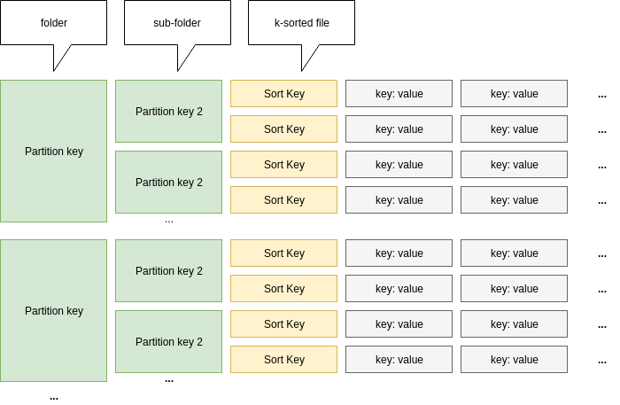

# ColumnFile : column oriented file storage

ColumnFile is a simple column oriented file storage solution for analyzing all kinds of data (csv, json, ...) using local files.

This solution allows efficient CRUD operations by key. Details concerning the implementation are available here : [see implementation details](https://operations-research.blog/2018/07/08/building-a-local-column-oriented-database-in-python/). It produces a file organization allowing fast access to data as follow : 



## Documentation

### Create and open operations
- `create(dbname, schema)` : creates the storage architecture and sets the db schema. The schema parameter must be a python dict containing two attributes : 'hash' and 'sort'. Both are lists of couples '(attribute_name, attribute_types)'. Allowed types are in ['string', 'int', 'float'].
- `open(dbname)` : opens an existing database

### Reading operations

- `get(key, report_error = False)` : returns the item associated to the key passed as parameter. If the 'report_error' parameter is set to False, empty objetcs are returned when no item matches the key. If True, the function raises an exception when nothin is found.
- `scan(sub_key, row_filter = lambda _: True)` : returns an iterator on all the values matching the sub_key. Values are sorted in ascending order with respected with the sort key. No particular order is imposed for hash keys. The row_filter function which can be passed as parameter allows you to filter the iterated values. Note that even if a filter is provided, all values are scanned. However, only those fullfilling the filter will be returned. 

### Writing operations

- `put(key, column_values)` : the put operation can be use to update a row by replacing all its columns by those passed in the column_values parameter. If no row matches the given key, a new row is created. 
- `merge(key, column_values)` : the merge operation can be use to update a row by merging the existing columns with the columns passed as parameter in column_values. If no row matches the given key, a new row is created. 
- `delete(key)` : deletes a row
- `commit()` : commits the changes to the database. Note that if no commit is performed after write operations, the database will not take them into account. 

## Example codes

```python
from ColumnFile import ColumnFile
from random import randint
import numpy as np

db = ColumnFile(verbose = True)

# create the database
db.create("demo-db", {
    "hash": [ ("year", "integer") ],
    "sort": [ ("month", "integer"), ("day", "integer") ]
})

# open the existing database
db.open("demo-db")

# let's add some data
for year in range(2012, 2018):
    for month in range(1, 13):
        for day in range(1, 32):
            operation_type = ['sell', 'buy'][randint(0,1)]
            amount = randint(1, 500)
            db.put((year, month, day), { "operation_type": operation_type, "amount": amount })

# change a specific column value
db.merge((2016, 6, 23), { "operation_amount": 250 })

# do NOT forget to commit
db.commit()

# retrieve one specific row and print its operation type
key, values = db.get((2016, 6, 23))
print(values['operation_amount'])

# compute average sell amount in 2016
results = db.scan(2016, row_filter = lambda row: row[1]['operation_type'] == 'sell')
sum_amount, n = sum(map(lambda row : np.array([row[1]['amount'], 1]), results))
average = sum_amount / n
print('Average = ', average)

```

## Example projects

- [COMING] [Modeling railway networks with the time expanded model](http://operations-research.blog)

