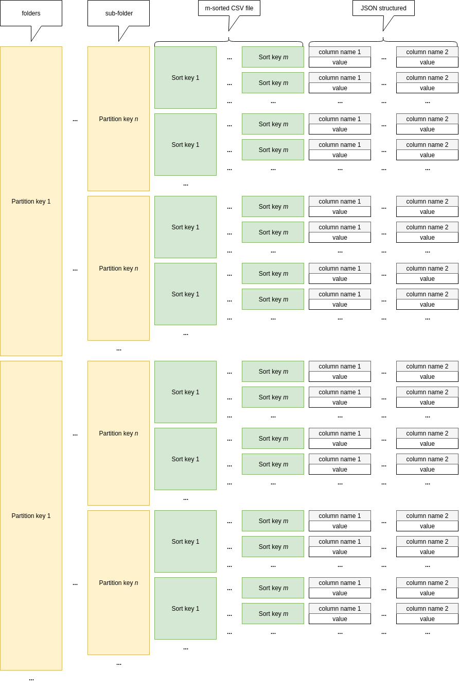

# column-file

Simple library to manage local file storage within an application based on the concept of local partition and sort keys

## Documentation

## Data organisation




### Database methods

- ``` create ``` : creates the "databse"
- ``` open ``` : opens a database

### Data methods

- ``` put ``` : idempotent modification/creation of content
- ``` delete ``` : [NOT IMPLEMENTED] deletion of content
- ``` find ``` : returns iterator of results, parameters are exact keys, or hash keys + sub sort keys
- ``` commit ``` : commits the operations ordered in ``` put ``` and ``` delete ``` (by merge-sorting the operations)

## Implementation quick details

- Sorting is done by external sort (size of chunk_size passed as parameter in ``` create ```)
- Merging is k-way merge
- Searching is binary search

## TODO : 
- allow partition functions other than identity (for the moment : partition key = folder/subfolder)
- implement delete operations
- fix problem with multiple put within the same commit
- implement schema (for now is ((string), string, int) to test but I should implement real schema options)
- close read mode file descriptors when committing
